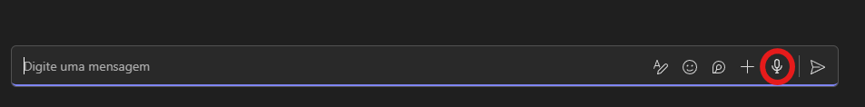
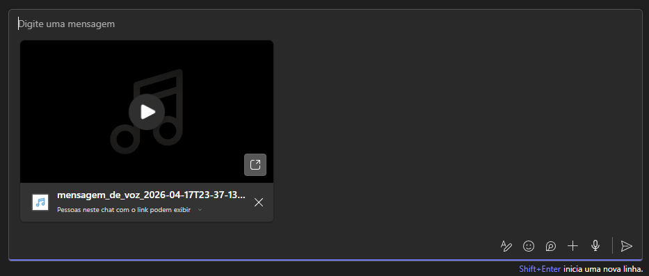

# Voice Message for Teams Web

Voice Message for Teams Web adds a microphone button to Microsoft Teams on the web so you can record audio locally in the browser and attach it to the current draft as a WAV file.

## What it does

- Adds a record button next to the Teams composer actions.
- Records audio locally with the browser microphone APIs.
- Converts the result to WAV before attaching it.
- Lets the user choose a preferred microphone.
- Lets the user enable or disable the browser's native noise suppression.

## Screenshots

### Record button in the Teams composer

### Recording in progress

### Audio attached to the draft

## Requirements

- Microsoft Teams Web
- A signed-in Teams account
- Microphone permission in the browser

## Local testing

The packaged ZIP in `dist/` is intended for distribution and store submission. For local testing, load the extension from `plugin/` as an unpacked extension.

1. Open `edge://extensions`.
2. Enable Developer mode.
3. Click Load unpacked.
4. Select the `plugin/` folder from this repository.
5. Open `https://teams.microsoft.com/` and start testing in a chat or channel composer.

## Usage

1. Open a chat or channel in Teams Web.
2. Click the microphone button added by the extension.
3. Allow microphone access if the browser asks.
4. Click once to start recording.
5. Click again to stop recording and attach the WAV file.
6. Send the message normally in Teams.

## Notes

- Audio capture and WAV conversion happen locally in the browser.
- No external backend is used.
- The extension stores only user preferences in browser storage.
- Maximum recording length is 5 minutes.
- If there is already a pending attachment in the draft, it must be sent or removed before recording another message.

## Privacy

Privacy policy: https://telegra.ph/Privacy-Policy---Voice-Message-for-Teams-Web-04-17

## Releases

Packaged artifacts are published on the GitHub Releases page:

https://github.com/arthurrogado/voice-msg-teams/releases